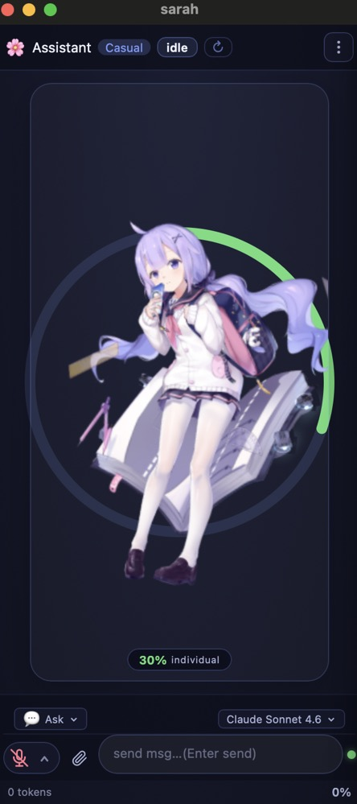
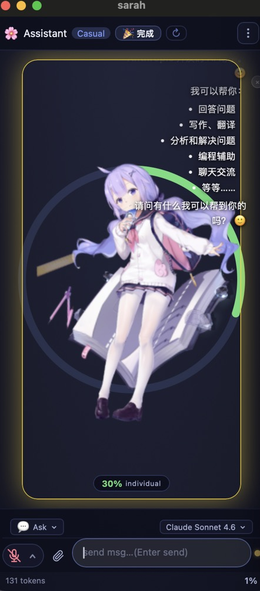
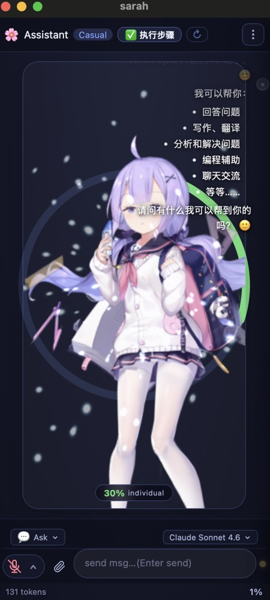
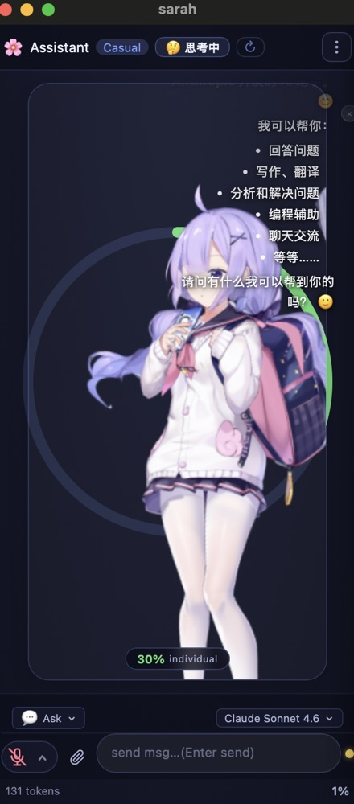
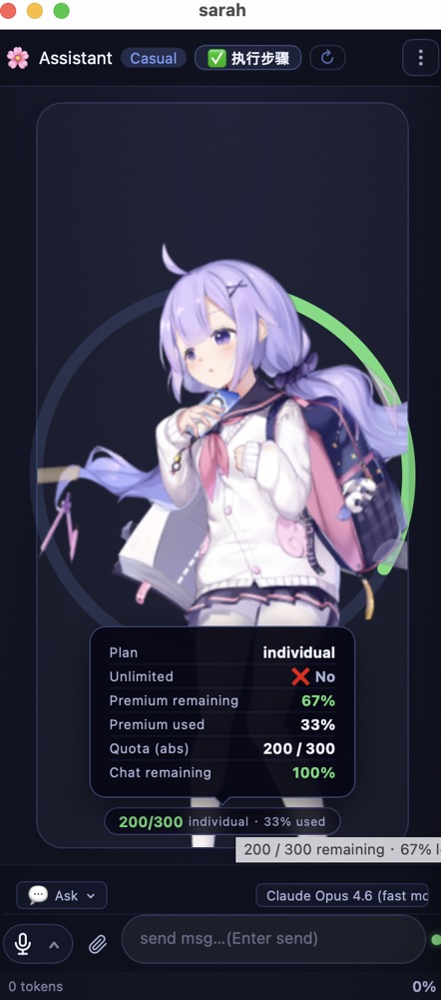

<div align="center">

# 🎀 AI Girls Desktop

**macOS AI 桌面助手原型 —— Live2D 虚拟形象 × 本地 Auth 凭证驱动的多模型 HTTP 接入 × 可持续扩展的桌面交互**

[](https://www.rust-lang.org/)
[](https://tauri.app/)
[](https://www.apple.com/macos/)
[](LICENSE)

</div>

---

## ✨ 项目简介

AI Girls Desktop 是一个运行在 macOS 上的桌面助手项目，目标是把 **Live2D 虚拟角色表现**、**多模型 AI 接入**、**桌面级工具能力** 和 **长期记忆** 融合到一个统一体验里。它不是单纯的聊天壳子，也不只是一个会动的看板娘，而是希望逐步演化成一个接近 **VS Code 中 GitHub Copilot Chat 那种全面能力** 的桌面 AI 工作台。

不过需要先说清楚：**当前仓库还处于"原型持续搭建阶段"**。现有版本已经完成了基础界面、Tauri + Rust 后端骨架、基于本地已有 auth 凭证的 HTTP 模型接入链路、基础工具运行时，以及 Live2D 的初步接入；但很多 README 里容易让人联想到"已经成熟可用"的能力，其实还只是部分完成，或者仍属于明确规划中的 TODO。这个版本更适合把它看成一个方向明确、架构已起步、功能仍在快速补齐的项目。

---

## 📌 当前状态一览

为了避免“看起来什么都有，实际上还在施工”的误解，这里把项目进度拆开说。简单讲，**GitHub Copilot 方向的支持目前相对更完整一些**，而其它模型与高级能力大多还停留在基础接入、预留接口或待完善阶段。也就是说，项目现在已经能展示方向，但距离“全能型桌面 AI 助手”还有不少工作要做。

从工程角度看，这个仓库已经有了一个不错的雏形：前端能够承载角色与对话 UI，后端已经有多模型适配器、工具运行时、角色系统、语音与 macOS 集成模块的结构划分，后续继续扩展不会是一团乱麻。真正还缺的是能力深度、稳定性、工具覆盖率、状态同步、长期记忆、以及更丰富的角色演出逻辑——说白了，舞台搭起来了，主演和配乐还在加班排练中。

### 已有基础能力

- Tauri v1 + Rust + 原生 JS/Pixi.js 的桌面应用骨架已经搭好，可作为后续功能扩展基础。
- 已实现基于本地 auth 凭证（`hosts.json`、`apps.json` 等）的多模型 HTTP 接入与 fallback 链，无需额外安装 CLI 工具。
- 已有基础的工具运行时，包括目录查看、文件读取、页面抓取、文本搜索等方向的能力接口。
- 已接入 Live2D 角色展示与基础动作表现，可以完成启动、待机、响应等初步演示。
- 已有角色系统、人设切换、主题色和状态表现的架构雏形，后续可继续做细。

### 目前仍然明显不足的部分

- 除 Copilot 相关路径外，其它模型提供方的体验、稳定性和能力覆盖都还不够完整。
- 目前还没有做到真正意义上的“本地长期 memory”，上下文记忆、人物设定沉淀、用户偏好学习都还需要单独建设。
- 工具调用能力离 IDE 级 Copilot Chat 还有较大差距，尤其是复杂任务编排、可靠的多轮工具协作、结果整合与可恢复执行。
- Live2D 现阶段更多是“可展示、可初步互动”，还没有形成足够丰富的动作库、舞蹈演出、服装切换管理和场景级联动。
- 语音、桌面自动化、MCP、系统级操作等能力都还需要继续补强，当前不能把它们理解为全面完成。

---

## 📸 界面预览

### 启动与待机



当前版本在视觉层面已经具备比较明确的产品气质：应用启动后，Live2D 角色会进入待机状态，界面会根据状态展示不同的光效和氛围变化。这部分已经能够说明项目不只是“命令行套壳”，而是确实在朝着角色化、桌面化的交互体验前进。

### 对话交互



右侧对话区域支持基础的问答交互，角色在 AI 思考与回答过程中会伴随状态反馈，比如思考泡泡、流式文本呈现等。这一层体验已经能展示产品方向，但距离“稳定、高强度、工程级实用”的聊天助手还有明显距离，尤其是在复杂任务执行和连续上下文管理上。

### 动作演示

<table>
  <tr>
    <td></td>
    <td></td>
    <td></td>
  </tr>
  <tr>
    <td align="center">动作组 1 — 待机 / 呼吸</td>
    <td align="center">动作组 2 — 响应 / 互动</td>
    <td align="center">动作组 3 — 额度 / 互动</td>
  </tr>
</table>

目前已有的动作更多集中在待机、呼吸、轻反馈这类基础表现层。后续会继续扩充动作资源和状态机逻辑，目标不只是“偶尔动一下”，而是要做出更完整的演出系统，例如更丰富的互动动作、情绪表达、舞蹈动作、剧情式切换、以及服装切换时的自然过场。换句话说，现阶段她已经会登台，但离一场完整演唱会还差一套灯光师、编舞和服装组。

---

## 🧠 AI 模型支持现状

项目**不依赖任何 CLI 工具**，而是直接读取机器上各工具链遗留的 auth 凭证文件（如 `~/.config/github-copilot/hosts.json`、各 IDE 的 `apps.json` 等），然后通过 **HTTP API** 直接与对应服务通信。好处是零额外安装成本，只要你已经在这台机器上登录过对应服务，凭证就可以被复用；坏处是凭证格式与端点随各家 API 政策变化，需要持续维护。最后兜底的 Mock 提供方在没有任何可用凭证时起作用。

| 优先级 | 模型 | 凭证来源 | 当前说明 |
|:---:|---|---|---|
| 1 | **Claude** (Anthropic) | `claude` CLI 本地会话 token | 已有适配思路，但整体体验仍待完善 |
| 2 | **Codex** (OpenAI) | `OPENAI_API_KEY` 或 CLI 本地凭证 | 已有入口，功能深度与稳定性仍需继续打磨 |
| 3 | **GitHub Copilot** | `hosts.json` / `apps.json` OAuth token | 当前相对最完整、最接近可持续使用的一条链路 |
| 4 | **Gemini** (Google) | `gemini` CLI 本地会话 token | 基础支持方向已留出，但能力仍偏早期 |
| 5 | Mock（离线备用） | 无需凭证 | 无可用凭证时的兜底演示 |

这里特别强调一下：**这张表表达的是"适配优先级与现有接入方向"，不是"每个模型都已经做到了完整支持"**。如果你是为了寻找"本地一配即拥有全套多模型桌面 Copilot"而来，那目前这个仓库还没有到那个阶段；如果你想找一个把多模型桌面助手、角色交互和工具链整合到一起的工程原型，这个仓库正朝着那个目标在走。

---

## 🧩 目标能力：向 Copilot Chat 级体验靠近

这个项目未来的核心目标之一，是让桌面 AI 的能力尽量接近甚至对标 **VS Code 中 GitHub Copilot Chat** 那种“能聊、能看、能搜、能调用工具、能维持上下文、能帮助完成复杂任务”的综合体验。换句话说，不是只回答一两句自然语言，而是要逐步做到：理解任务、读取信息、组合工具、生成结果、记录上下文，并在多轮对话中保持一致的人设和工作状态。

要实现这件事，还需要补齐不少关键模块。首先是更完整的工具体系和稳定的任务编排，其次是本地 memory，包括用户偏好、历史上下文、项目级事实、角色状态等内容的持久化；再往后才是更智能的代理协作、多阶段任务分解、以及像 Copilot Chat 一样更自然的“边看边做边反馈”工作流。现在仓库里已经能看到这条路线的骨架，但距离“全面可用”还需要持续迭代。

---

## 🎭 角色系统与表现层规划

当前项目已经有 Assistant、Coder、Researcher、Planner、Analyst、Security、Orchestrator 这类角色方向，它们更像是未来能力分工与视觉状态的基础抽象。现阶段这套系统的价值主要在于给后续扩展打地基：不同人设可以拥有不同主题色、对话语气、动作偏好、工具倾向，甚至将来还可以进一步绑定不同模型策略和记忆片段。

| 角色 | 图标 | 主要场景 | 当前状态 |
|---|:---:|---|---|
| Assistant | 🌸 | 默认对话 | 已有基础定位 |
| Coder | 💻 | 编程 / 代码问题 | 可继续绑定更强工具链 |
| Researcher | 🔍 | 搜索 / 浏览 / 调研 | 仍需增强网页与资料整合能力 |
| Planner | 📋 | 计划 / TODO / 分解任务 | 仍需强化任务管理与记忆联动 |
| Analyst | 📊 | 数据 / 指标 / 总结 | 仍偏概念层，待补执行链路 |
| Security | 🛡️ | 安全 / 审计 / 检查 | 仍待扩展专业工具与规则 |
| Orchestrator | 🎼 | 多 Agent / 编排 | 目标明确，但能力尚在建设中 |

后续在表现层上，除了人设切换，还会继续做 **动作扩展、情绪表达、舞蹈动作、服装变换、场景化演出、状态联动** 等能力。尤其是服装与动作，未来不会只是静态资源切换，而是希望做成更完整的运行时系统：在不同模式下切换服饰、动作组、表情和背景氛围，让角色真正成为“会工作、会反馈、会演出”的桌面伙伴，而不是单一皮肤资源的播放器。

---

## 🛠️ 工具能力现状

当前仓库已经设计并实现了一批基础工具接口，这为未来形成更强的桌面 AI 执行力提供了出发点。现阶段这些工具更适合被理解为“可用的底层积木”，而不是已经形成成熟产品体验的完整能力集；它们说明项目具备往下挖的可能，但还需要在权限控制、错误恢复、结果总结、长任务编排和用户可见反馈上继续完善。

- **Terminal**：面向安全白名单的只读 shell 命令能力，适合做基础环境查看与信息采集。
- **ReadFile**：读取本地文件内容，当前更偏向信息获取，不等于 IDE 级全局理解。
- **BrowsePage**：通过 `curl` 获取网页并做纯文本提取，可用于轻量级资料抓取。
- **ListDir**：列出目录结构，用于本地项目和资源浏览。
- **SearchFiles**：使用 `rg` / `grep` 搜索文本内容，是代码与文档搜索的基础能力。
- **McpCall**：预留通过 stdio 调用 MCP 服务器的方向，但整体生态联动仍有很多可做空间。

如果未来要做到真正接近 Copilot Chat 的全面性，这一层还需要继续扩展到更强的代码理解、上下文汇总、任务型多工具协作、操作回滚、可解释执行过程，以及本地 memory 的深度集成。现在的工具层已经不是空白，但距离“随手一问就能稳稳干活”的成熟度，还有一段很实在的路要走。

---

## 🧠 本地 Memory：未来必须补齐的核心能力

本地 memory 是这个项目后续最关键的能力之一，因为没有记忆，角色再漂亮也容易变成“每次开口都像第一次见面”。项目未来希望引入真正的本地持久化记忆体系，用于保存用户偏好、近期任务、历史对话摘要、项目上下文、角色状态以及特定工作流中的结构化事实，从而让助手在多轮对话和多次启动之间保持连续性。

这部分不仅是为了“聊天更自然”，更是为了让它真正具备生产力价值。一个接近 Copilot Chat 的桌面助手，不应该每次都重新认识项目、重新理解用户习惯、重新猜测需求；它应该能知道你最近在做什么、上次卡在哪、你更偏好哪种回答风格、你常用哪些工具，甚至能根据角色状态做出更稳定的反馈。当前仓库还没有把这套体系真正落地，这会是后续重点建设方向之一。

---

## 🎨 Live2D 角色资产

仓库中已经放入了多套 Live2D 模型资源，这让项目后续在角色、服装、动作和风格层面具备不错的扩展空间。当前这些资源的价值，主要在于为运行时切换、动作映射、服装管理和演出系统提供素材基础；但资源“存在”不等于体验“已经打磨完成”，如何把这些模型真正串成统一而自然的交互体验，仍然需要后续大量工程工作。

| 目录 | 角色 | 格式 |
|---|---|---|
| `dujiaoshou_4/` | 独角兽系 | Cubism 4 (`.moc3`) |
| `kelifulan_3/` | 克里夫兰 | Cubism 3 (`.moc3`) |
| `mashiro_*/` | 真白（三套服装） | Cubism 2 (`.moc`) |
| `sagiri/` | 紗霧 | Cubism 2 (`.moc`) |
| `nep/` | 涅普 | Cubism 2 (`.moc`) |
| `tia/` | Tia | Cubism 2 (`.moc`) |
| `xianghe_2/` | 香荷 | Cubism 3 (`.moc3`) |

未来会重点围绕这些资产做三件事：第一是统一加载与状态管理，第二是扩展动作库与情绪反馈，第三是把服装切换、动作切换和对话状态联动起来。目标不是“模型更多”，而是“模型表现更像一个真正有状态、有节奏、有反馈的桌面角色”。

---

## 🗺️ 开发路线图

下面这份路线图不是绝对排期，而是当前最核心的建设方向。它比“功能宣传”更重要，因为这个项目真正的价值不在于一次性列出很多概念，而在于把每一层能力逐步做扎实。

### 近期重点

1. 继续把 Copilot 之外的模型链路补齐，让 Claude / Codex / Gemini 等路径从“能接上”走向“更稳定可用”。
2. 完善本地 memory，建立用户偏好、历史任务、上下文摘要、角色状态等持久化能力。
3. 强化工具运行时与编排逻辑，让 AI 不只是调用单个工具，而是能更稳定地完成多步骤任务。
4. 扩充 Live2D 动作系统，增加更多互动动作、舞蹈动作、情绪动作和服装切换流程。
5. 提升整体产品完成度，包括状态同步、异常处理、交互反馈、权限提示和 UI 细节打磨。

### 中期目标

1. 做到更接近 VS Code GitHub Copilot Chat 的综合体验：能理解项目、能组合工具、能维持连续上下文、能帮助完成复杂工作流。
2. 建立更完整的角色驱动架构，让不同 persona 不只是换颜色，而是真正拥有差异化的行为与能力偏好。
3. 引入更稳定的本地知识沉淀机制，让助手随着使用逐渐“认识你、认识你的项目、认识你的习惯”。
4. 让桌面交互、语音、系统权限与角色演出形成统一体验，而不是各模块各玩各的。

---

## 🚀 快速开始

### 环境要求

- macOS 12 Monterey 或更高版本
- [Rust 1.85+](https://rustup.rs/)，用于构建 Tauri 后端与相关 Rust 模块
- [Node.js 18+](https://nodejs.org/)，用于前端资源与 Tauri 开发链路
- [Tauri CLI v1](https://tauri.app/v1/guides/getting-started/prerequisites/)，用于本地开发与打包

### 安装与运行

```bash
git clone https://github.com/0xdx2/ai_girls.git
cd ai_girls

# 开发模式（热重载）
cargo tauri dev --manifest-path sarah-tauri/Cargo.toml

# 生产构建（输出 .app / .dmg）
cargo tauri build --manifest-path sarah-tauri/Cargo.toml
```

### 凭证准备（按需）

项目通过读取本地已有的 auth 凭证文件来接入各模型服务，**无需为此单独安装任何 CLI 工具**。只要你在同一台机器上已经登录过对应服务，凭证通常就已经就位：

| 服务 | 凭证自动读取来源 |
|---|---|
| GitHub Copilot | `~/.config/github-copilot/hosts.json`、各 IDE `apps.json` |
| Claude | `claude` CLI 写入的本地会话文件 |
| Gemini | `gemini` CLI 写入的本地会话文件 |
| OpenAI / Codex | `OPENAI_API_KEY` 环境变量或 CLI 本地凭证 |

如果需要手动指定，也可以通过环境变量覆盖：

```bash
export COPILOT_GITHUB_TOKEN=ghu_...
export OPENAI_API_KEY=sk-...
```

---

## 🔐 macOS 权限说明

由于项目目标不仅是聊天，还涉及桌面级能力与系统集成，所以应用在首次运行时会检查一部分 macOS 权限状态。当前这一层已经具备基础检测逻辑，但在实际产品体验上，权限引导、异常提示和失败恢复依然有提升空间，因此请把它理解为“已有接入”而不是“全流程已完善”。

| 权限 | 用途 |
|---|---|
| **辅助功能 (Accessibility)** | 支持桌面自动化相关能力 |
| **麦克风** | 语音输入管线（可选） |
| **屏幕录制** | 屏幕上下文感知（可选） |

如果是在 CI 或受控环境中运行，也可以通过环境变量跳过部分权限检测：

```bash
export MACOS_ACCESSIBILITY_GRANTED=1
export MACOS_MICROPHONE_GRANTED=1
export MACOS_SCREEN_RECORDING_GRANTED=1
```

---

## 🏗️ 项目结构

项目整体采用前后端分层结构，Rust 负责 Tauri 宿主、模型编排、工具运行时和系统集成，前端负责 Live2D、对话界面和交互表现。这个结构对后续扩展是友好的，因为无论是补 memory、扩工具、加动作系统，还是加强多模型协作，都已经有比较清晰的落点。

```text
ai_girls/
├── sarah-tauri/              # Rust 后端（Tauri 进程）
│   └── src/
│       ├── main.rs               # Tauri 命令注册与状态管理
│       ├── ai_adapters.rs        # 多模型 HTTP 适配器与 fallback 链（凭证自动探测）
│       ├── orchestrator.rs       # Agent 编排与多轮对话循环
│       ├── persona_system.rs     # 角色系统与人设配置
│       ├── tool_runtime.rs       # 安全工具执行沙箱
│       ├── voice_pipeline.rs     # 语音处理管线
│       ├── avatar_runtime.rs     # Live2D 运行时控制
│       └── macos_integration.rs  # macOS 权限与自动化集成
└── sarah-ui/                 # 前端（原生 JS + Pixi.js）
    ├── index.html
    ├── app.js
    ├── styles.css
    ├── assets/               # Live2D 模型与相关资源
    └── vendor/               # Live2D Cubism SDK 与依赖
```

---

## 🤝 贡献说明

欢迎提交 Issue 和 PR，尤其欢迎围绕以下方向一起完善：多模型适配、本地 memory、工具编排、Live2D 动作系统、服装切换、角色状态管理、以及桌面级交互体验。这个项目当前最需要的不是“再补几个概念名词”，而是把已有方向做深、做稳、做成真正能长期演进的工程基础。

提交前建议至少确认以下检查通过：

```bash
cargo clippy --all-targets --all-features --fix --allow-dirty -- -D warnings
cargo fmt --check
```

---

## 📄 License

本项目代码部分采用 [MIT License](LICENSE)。仓库中的 Live2D 模型及相关美术资产版权归各自原作者或权利方所有，使用、分发或二次创作前请务必阅读对应资源目录中的许可说明。代码能开源，老婆不一定能随便搬——这个边界还是要尊重一下的。
